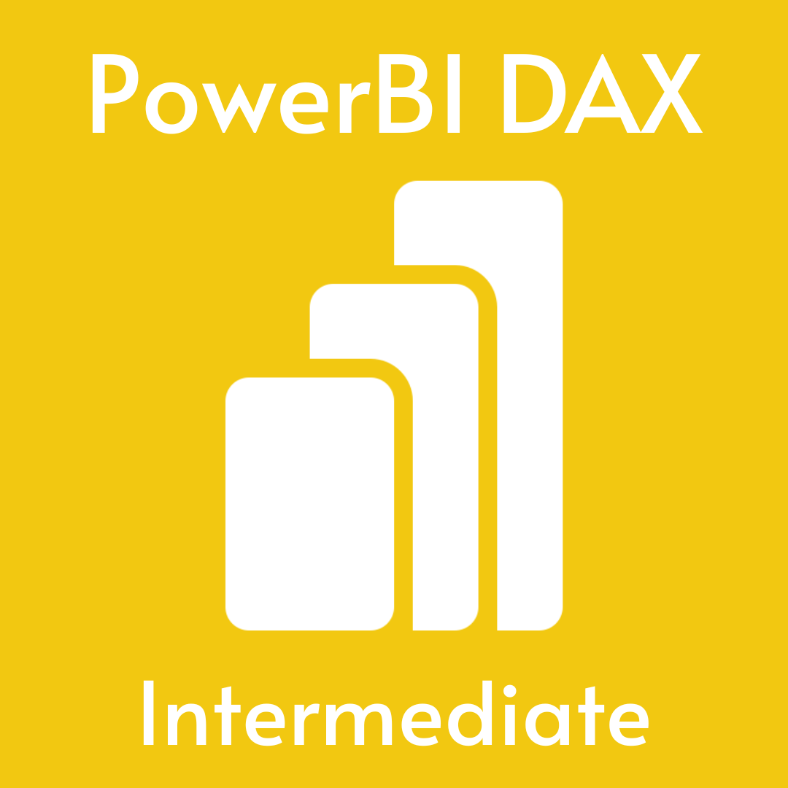
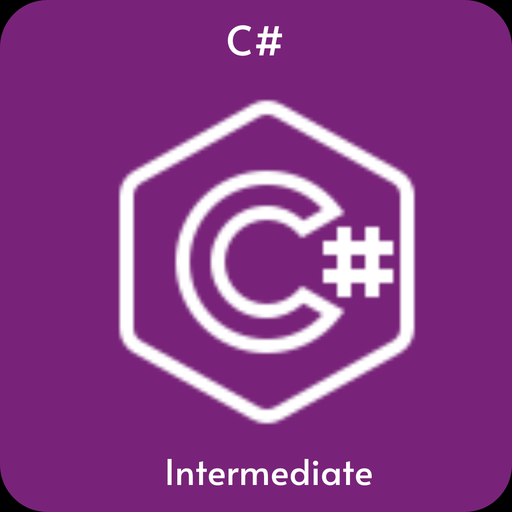
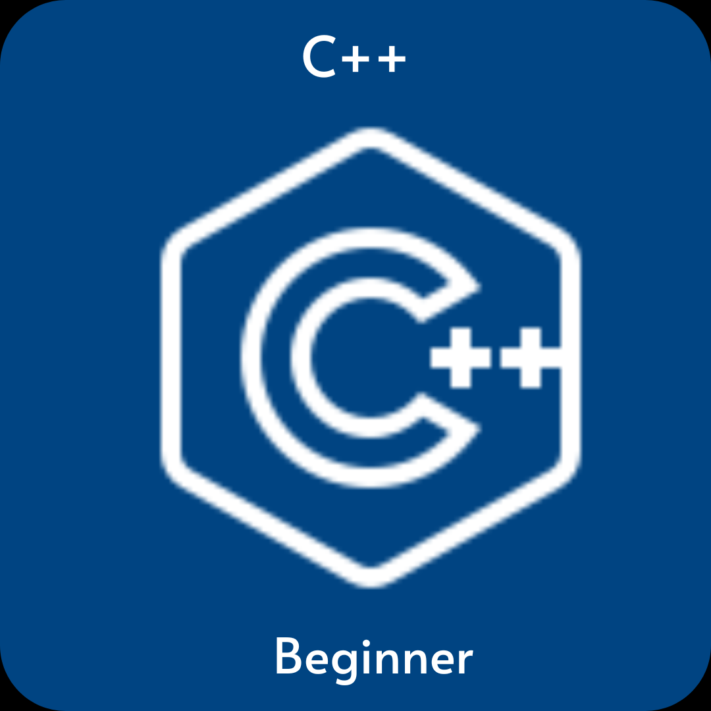

<!--Header--> 

  

<!-----profile Image--->
  

    
  

  
<h1>Hi 👋, I'm Shashikanth Bhat</h1>

   <!--Occupation-->
  <h3 align="center">
    PowerBI Analyst | Statistician | Research & Analytics Expert
  </h3>
  <!---Social-->
  

     
&nbsp;

&nbsp;

  

<!--About Me Section--->
# 💫 About Me:
  <!-----profile Image--->
  

    
  

  <!-----Intro--->
  

      Power BI Analyst with 3+ years of experience and a Statistician with 10+ years of expertise, transforming complex data into actionable insights across healthcare, finance, and research. Skilled in building interactive dashboards, data modeling, and advanced analytics, with strong proficiency in Power BI, SQL, R, Python, and SAS to drive data-driven decisions and measurable business impact.
  

  <ul align="left">
    <li>🔭 I’m currently working on 
      
        <strong>
          <a href="https://github.com/shashi120992/Pac-Man">supply Chail Dashboard</a>
        </strong>
      
    </li>
    <li>🌱 I’m Expirienced in
        
          <strong>
            R Programming, SPSS & PowerBI DAX
          </strong>
        
        currently learning 
       
         <strong>
          C#,C++, Data Structures & Algorithms
        </strong>
       
        .
    </li>
    <li>
      👨‍💻 All of my projects are available at
      
        <strong>
          <a href="https://shashi120992.wixsite.com/shashikanth">My Portfolio</a>
        </strong>
      
    </li>
    <li>
      📫 How to reach me
      
        <strong>
          <a href="mailto:shashkanthmbhat@gmail.com">shashkanthmbhat@gmail.com</a>
        </strong>
      
    </li>  
  </ul>
   
   

 <!--Programming Language Section----->
# 💻 Tech Stack:
<!--summary-->
<h3 align="left">Current Learning</h3>
      <ul align="left">
        <li>Improving my skills in statistical analysis with PowerBI, R and Python</li>
        <li>Deepening my knowledge in Machine Learning and AI.</li>
        <li>Exploring advanced C#, C++ and state management techniques.</li>
      </ul>
      
  <h3>Business Intelligence Tools:</h3>
  <ul align="left">
    <li>PowerBI</li>
    <li>Excel VBA</li>
    <li>R Programming</li>
    <li> SPSS</li>
    <li>Python</li>
  </ul>

  
  <h3>Data Analysis & Modelling:</h3>
 <ul align="left">
    <li>DAX</li>
    <li>Power Query</li>
    <li>ETL</li>
    <li>Data Warehousing</li>
  </ul>

   <!-- Programming Languages -->
  <h3>Programming Languages:</h3> 
   <ul align="left">
    <li>DAX</li>
    <li>VBA</li>
    <li>R Programming</li>
    <li>C#</li>
     <li>C++</li>
  </ul>
   

     
     &nbsp;&nbsp;
     
     &nbsp;&nbsp;
     
     &nbsp;&nbsp;
     
     &nbsp;&nbsp;
     
   

   
   

     
   

   
   

    
    &nbsp;&nbsp;
    
    &nbsp;&nbsp;
    
    &nbsp;&nbsp;
   

 
  <!--Statistical Skills-->
<h3>Statistical Skills :</h3>

  
  &nbsp;
  
  &nbsp;
  
  &nbsp;
  
  
  
  &nbsp;
  
  &nbsp;
  
  &nbsp;
  
  &nbsp;
  
  &nbsp;
  
  &nbsp;
  
  &nbsp;
  

## 🚀 Languages and Tools:

 
    
    
        
    
     

<!---------------------------->

<!-----Github Stats-------->
  # 📊 GitHub Stats:
  <!----Read Me & Streek Stats---------->

&nbsp;

 
<!--------- Most Used Languages----

-------->

<!--Contact Section--> 

<h2 align="center">🤝 Connect With Me @ 🤝 </h2>

  

&nbsp;
&nbsp;

&nbsp;
&nbsp;

&nbsp;
&nbsp;

&nbsp;
&nbsp;

&nbsp;
&nbsp;

&nbsp;
&nbsp;

&nbsp;
&nbsp;

<!--Footer--> 

  

<!--End Of Page>
